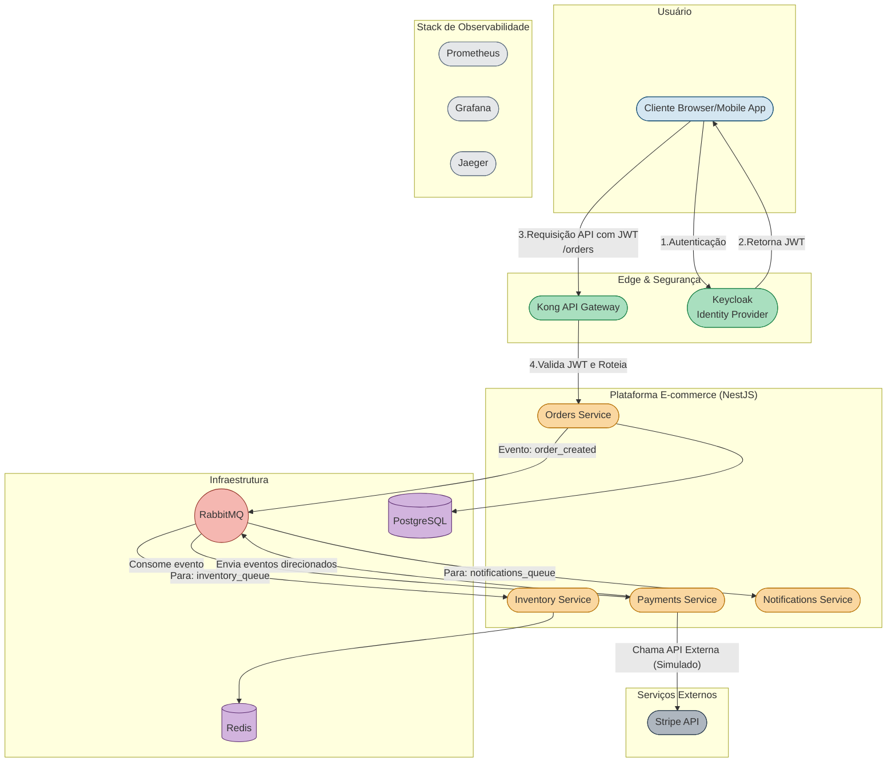

# Backend para E-commerce: Arquitetura de Microsserviços

\<p align="center"\>
\<a href="\#-features-principais"\>Features\</a\> •
\<a href="\#-tecnologias-utilizadas"\>Tecnologias\</a\> •
\<a href="\#-arquitetura-do-sistema"\>Arquitetura\</a\> •
\<a href="\#-como-executar-o-projeto"\>Como Executar\</a\> •
\<a href="\#-testando-a-aplicação"\>Testes\</a\> •
\<a href="\#-english-version"\>English Version\</a\>
\</p\>

Este projeto é uma implementação completa do backend de um sistema de e-commerce, desenvolvido em um monorepo NestJS. Ele simula um ambiente de produção real, focando em práticas de engenharia de software para construir sistemas distribuídos que são **resilientes, escaláveis, seguros e observáveis**.

A arquitetura é baseada em eventos e utiliza um conjunto de tecnologias modernas para resolver desafios comuns de backend.

## ✨ Features Principais

  - **Arquitetura de Microsserviços:** Lógica de negócio dividida em serviços independentes (`orders`, `payments`, `inventory`, `notifications`).
  - **Comunicação Assíncrona:** Uso de RabbitMQ para comunicação robusta e desacoplada entre os serviços.
  - **Segurança Centralizada:** Autenticação e autorização gerenciadas por um API Gateway (Kong) e um Identity Provider (Keycloak), seguindo o padrão JWT.
  - **Persistência Poliglota:** Uso do banco de dados certo para a tarefa certa (PostgreSQL para dados transacionais e Redis para dados rápidos como estoque).
  - **Ambiente 100% Contêinerizado:** Todo o ecossistema (serviços e infraestrutura) é orquestrado com Docker e Docker Compose.
  - **Testes Automatizados:** Suíte de testes unitários e de integração (com Testcontainers) para garantir a qualidade do código.

## 🚀 Tecnologias Utilizadas

| Categoria | Tecnologia |
| :--- | :--- |
| **Framework Principal** | NestJS (TypeScript) |
| **API Gateway** | Kong |
| **Identidade & Segurança**| Keycloak (seguindo padrão OIDC/JWT) |
| **Mensageria** | RabbitMQ |
| **Banco de Dados** | PostgreSQL, Redis |
| **Testes** | Jest, Supertest, Testcontainers |
| **Containerização** | Docker, Docker Compose |
| **Observabilidade** | Prometheus, Grafana, Jaeger |

## 🗺️ Arquitetura do Sistema

O diagrama abaixo ilustra a interação entre os diferentes componentes da arquitetura.



## ⚙️ Como Executar o Projeto

Todo o ambiente está contêinerizado, então você só precisa ter o **Docker** e o **Docker Compose** instalados.

**1. Clone o Repositório**

```bash
git clone https://github.com/seu-usuario/seu-repositorio.git
cd seu-repositorio
```

**2. Crie o Arquivo de Ambiente**
Crie uma cópia do arquivo `.env.example` e renomeie para `.env`. Este arquivo já contém os valores padrão para o ambiente de desenvolvimento.

```bash
cp .env.example .env
```

**3. Inicie o Ambiente Docker**
Este comando irá construir as imagens de todos os microsserviços e iniciar toda a infraestrutura (bancos de dados, Kong, Keycloak, etc.).

```bash
docker-compose up -d --build
```

A primeira execução pode levar alguns minutos para baixar e construir tudo.

**4. Gerenciando os Contêineres**

  * Para ver os logs de todos os serviços em tempo real:
    ```bash
    docker-compose logs -f
    ```
  * Para ver os logs de um serviço específico (ex: `orders-service`):
    ```bash
    docker logs -f orders_service
    ```
  * Para parar todo o ambiente:
    ```bash
    docker-compose down
    ```

**5. Configuração Inicial (Keycloak e Kong)**
Após iniciar os contêineres, é necessário realizar uma configuração inicial para a camada de segurança. Siga o guia detalhado no link abaixo:

  * **[GUIA DE CONFIGURAÇÃO DE SEGURANÇA (KEYCLOAK E KONG)](https://www.google.com/search?q=./SETUP_SECURITY.md)** *(Recomendação: Mova os comandos `curl` para um arquivo separado como este para manter o README limpo)*

## 🧪 Testando a Aplicação

Os testes são uma parte crucial do projeto e estão divididos em duas categorias.

**1. Testes Unitários**
Testam a lógica de negócio de cada serviço de forma isolada (com mocks). Para rodar os testes de um serviço específico (ex: `orders`):

```bash
npm run test orders
```

**2. Testes de Integração (E2E)**
Testam o fluxo completo de um serviço, incluindo a interação com um banco de dados real iniciado via Testcontainers. Para rodar os testes de integração do `orders-service`:

```bash
npm run test:e2e:orders
```

-----

## 🇬🇧 English Version

### E-commerce Backend: A Microservices Architecture

This project is a complete backend implementation for an e-commerce system, developed as a NestJS monorepo. It simulates a real-world production environment, focusing on software engineering best practices to build **resilient, scalable, secure, and observable** distributed systems.

The architecture is event-driven and utilizes a modern tech stack to solve common backend challenges.

### ✨ Key Features

  - **Microservices Architecture:** Business logic is split into independent services (`orders`, `payments`, `inventory`, `notifications`).
  - **Asynchronous Communication:** Uses RabbitMQ for robust, decoupled inter-service communication.
  - **Centralized Security:** Authentication and authorization are handled by a Kong API Gateway and a Keycloak Identity Provider, following the JWT standard.
  - **Polyglot Persistence:** Employs the right database for the right task (PostgreSQL for transactional data, Redis for high-speed data like stock).
  - **100% Containerized Environment:** The entire ecosystem is orchestrated with Docker and Docker Compose.
  - **Automated Testing:** Includes a suite of unit and integration tests (with Testcontainers).

### 🚀 Tech Stack

| Category | Technology |
| :--- | :--- |
| **Main Framework** | NestJS (TypeScript) |
| **API Gateway** | Kong |
| **Identity & Security**| Keycloak (OIDC/JWT) |
| **Messaging** | RabbitMQ |
| **Database** | PostgreSQL, Redis |
| **Testing** | Jest, Supertest, Testcontainers |
| **Containerization** | Docker, Docker Compose |
| **Observability** | Prometheus, Grafana, Jaeger |

### ⚙️ How to Run the Project

The entire environment is containerized. You only need **Docker** and **Docker Compose** installed.

**1. Clone the Repository**

```bash
git clone https://github.com/your-user/your-repo.git
cd your-repo
```

**2. Create the Environment File**
Copy the `.env.example` file to create your local `.env` file.

```bash
cp .env.example .env
```

**3. Start the Docker Environment**
This command builds the images for all microservices and starts the entire infrastructure.

```bash
docker-compose up -d --build
```

**4. Managing Containers**

  * To view logs for all services in real-time:
    ```bash
    docker-compose logs -f
    ```
  * To stop the entire environment:
    ```bash
    docker-compose down
    ```

**5. Initial Setup (Keycloak & Kong)**
After starting the containers, an initial security setup is required. Follow the detailed guide at the link below:

  * **[SECURITY SETUP GUIDE (KEYCLOAK & KONG)](https://www.google.com/search?q=./SETUP_SECURITY.md)** *(Recommendation: Move the `curl` commands to a separate file like this to keep the README clean)*

### 🧪 Testing the Application

**1. Unit Tests**
To run the unit tests for a specific service (e.g., `orders`):

```bash
npm run test orders
```

**2. Integration (E2E) Tests**
To run the integration tests for the `orders-service`, which spin up a real database via Testcontainers:

```bash
npm run test:e2e:orders
```