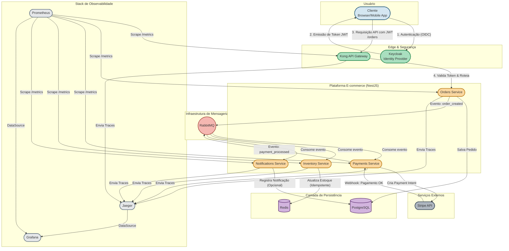

# Backend para E-commerce: Arquitetura de Microsserviços

Este projeto é uma implementação completa do backend de um sistema de e-commerce, desenvolvido em um monorepo NestJS. Ele simula um ambiente de produção real, focando em práticas de engenharia de software para construir sistemas distribuídos que são **resilientes, escaláveis, seguros e observáveis**.

A arquitetura é baseada em eventos e utiliza um conjunto de tecnologias modernas para resolver desafios comuns de backend.

## Tecnologias Utilizadas 🚀

| Categoria | Tecnologia |
| :--- | :--- |
| **Arquitetura & Padrões** | Microsserviços, Arquitetura Orientada a Eventos (EDA), API Gateway |
| **Framework Principal** | NestJS (TypeScript) |
| **Segurança & Autenticação** | Kong (API Gateway), Keycloak (Identity Provider - OIDC) |
| **Mensageria** | RabbitMQ |
| **Banco de Dados** | PostgreSQL (Dados Transacionais), Redis (Cache/Estoque) |
| **Observabilidade** | Prometheus (Métricas), Grafana (Dashboards), Jaeger (Tracing) |
| **Integrações Externas** | Stripe (Gateway de Pagamento) |
| **Containerização** | Docker |

## Arquitetura do Sistema 🗺️

O diagrama abaixo ilustra a interação entre os diferentes componentes da arquitetura, desde a requisição do cliente até o processamento assíncrono dos eventos.

-----
